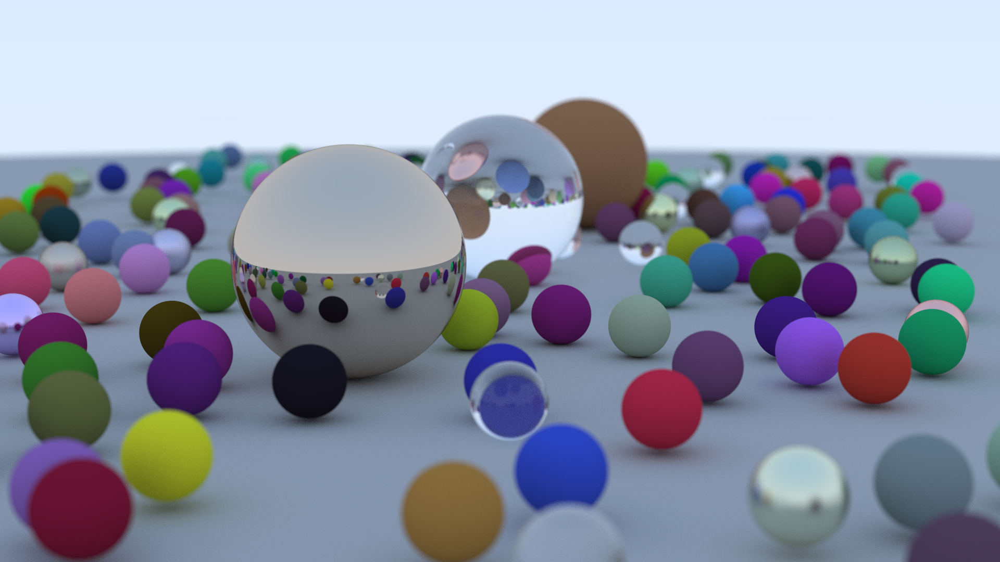

# RayTracer
This is a simple CPU raytracer that written by C++20.
# feature
Simple Material  
Fuzzy Effect (for Metal)  
Positionable Camera  
Defocus Blur  
A future
# Picture

# Reference
[Ray Tracing in One Weekend](https://raytracing.github.io/books/RayTracingInOneWeekend.html)